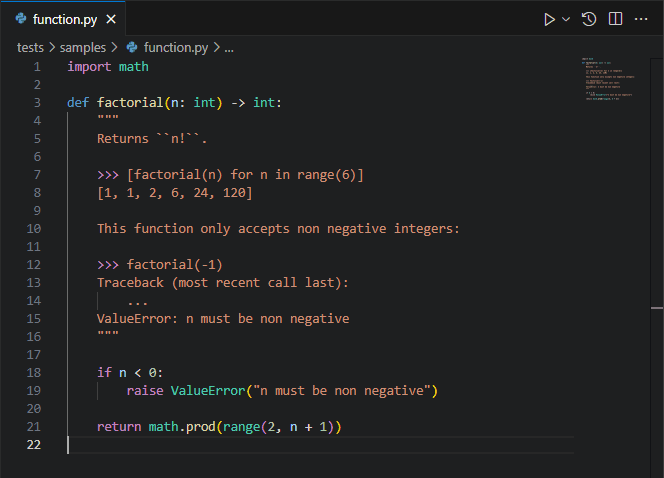

# Convert to Notebook

This is a VS Code extension to convert files to notebooks.

This extension just acts as a frontend integrated into VS Code, a separate backend such as [doctests-to-notebook] is required.

## Requirements

To use the extension:

1. Install a backend to carry out the conversion, for instance [doctests-to-notebook].
2. Configure the extension to use the backend by updating the following settings:
    - Executable (`convertToNotebook.executable`), e.g. `python`.
    - Args (`convertToNotebook.args`), e.g. `["path/to/doctests-to-notebook/src/main.py"]`.

[doctests-to-notebook]: https://github.com/ntestu/doctests-to-notebook
